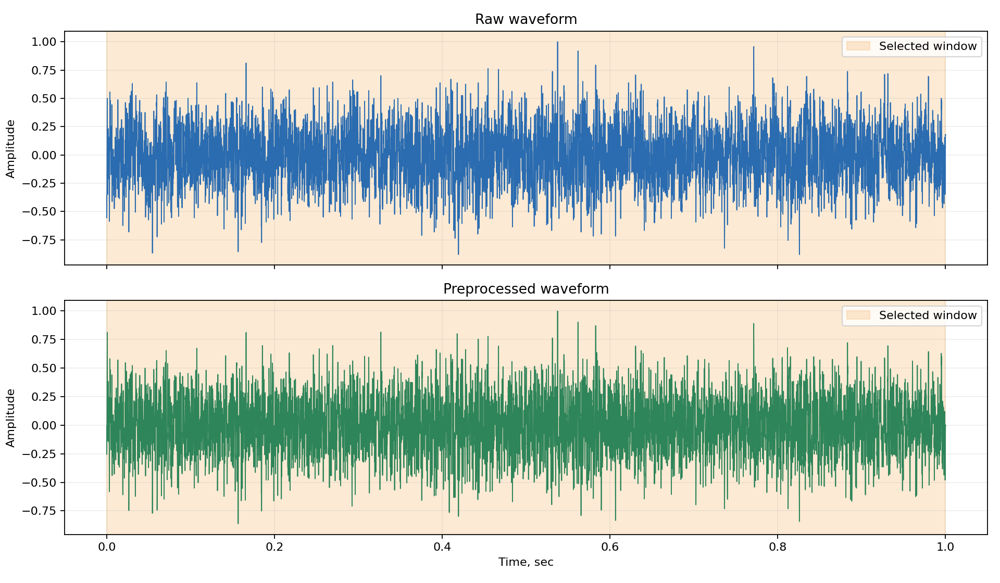
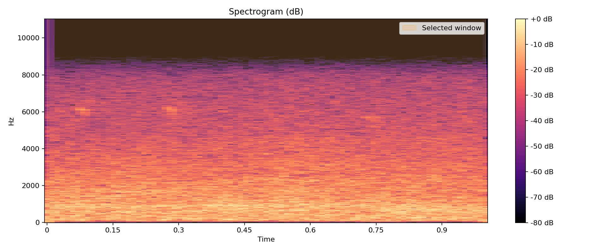
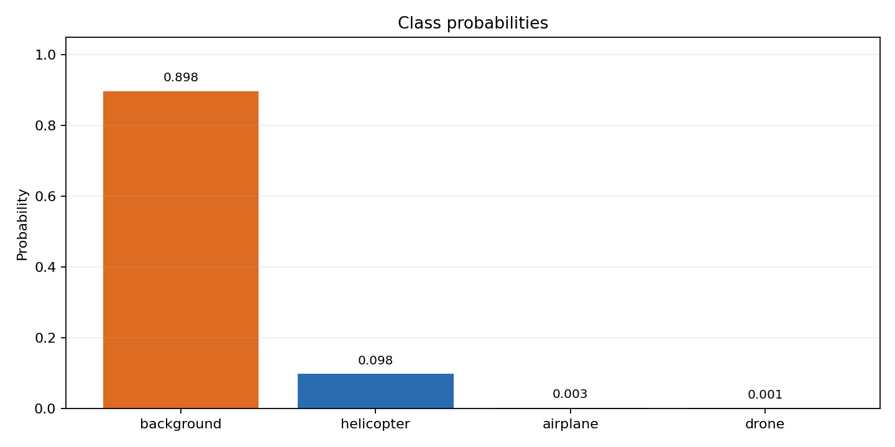
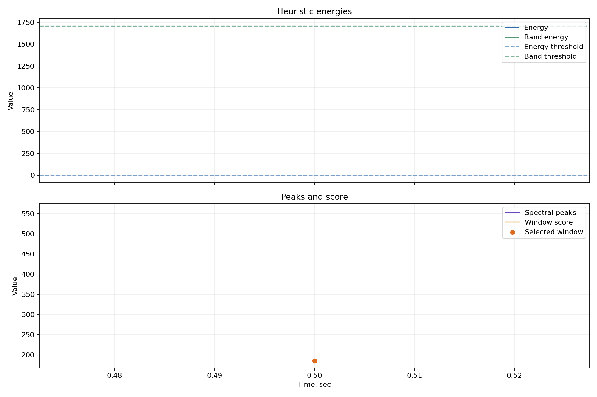

# Презентационный отчет по инференсу

- Дата: 2026-05-17 22:24:52
- Входной файл: `C:\Users\aslan\Desktop\МГТУ\ВКР\BMSTU-VKR-UAV-Classification\train_sounds\dataset_out\test\audio\000000.wav`

## Итог классификации

- Решение: `accepted`
- Тип цели: `background`
- Сырой класс: `background` (id=0)
- Confidence: `0.8977`
- Signal level (RMS): `0.236074`
- Выбранный интервал: `0.000 .. 1.000 sec`
- Количество информативных окон: `0`

## Вероятности классов

| Класс | Вероятность |
|---|---:|
| `background` | `0.8977` |
| `helicopter` | `0.0985` |
| `airplane` | `0.0026` |
| `drone` | `0.0012` |

## Сообщение для системы наведения

```json
{
  "target_type": "background",
  "confidence": 0.8976556750211708,
  "time_start": 0.0,
  "time_end": 1.0,
  "decision": "accepted"
}
```

## Сообщение для подсистемы локализации

```json
{
  "signal_level": 0.23607414960861206,
  "time_start": 0.0,
  "time_end": 1.0,
  "channel_levels": null
}
```

## Визуализации

### 1) Форма сигнала и выбранное окно


### 2) Спектрограмма и выбранное окно


### 3) Вероятности классов


### 4) Эвристики по окнам

